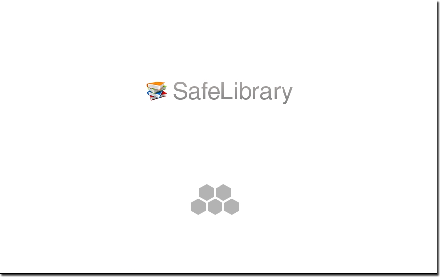
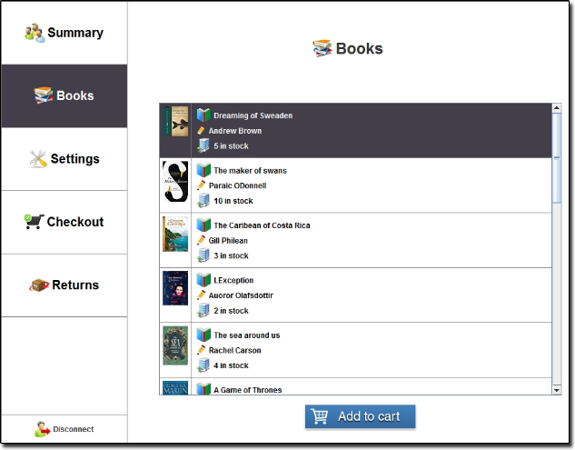
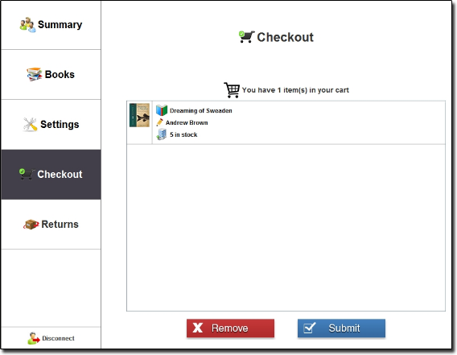
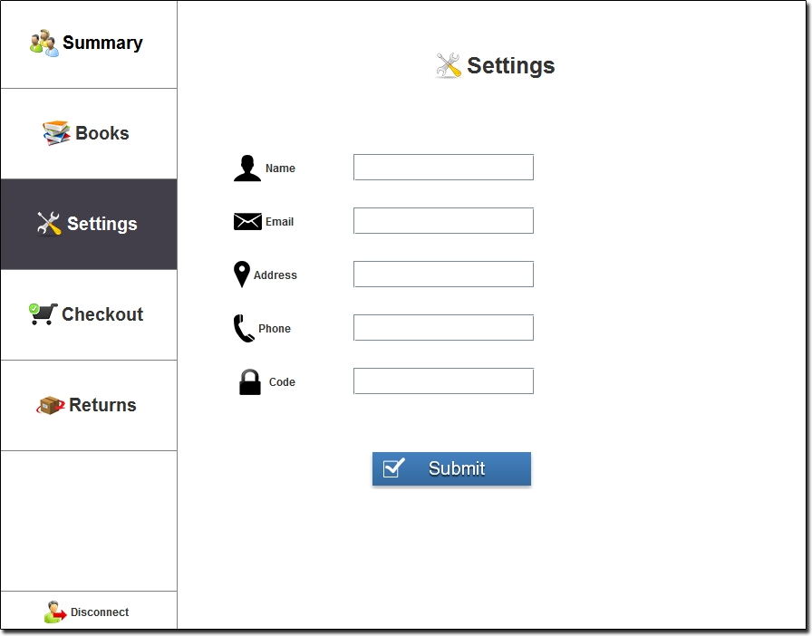

# SafeLibrary



[](https://forthebadge.com)

### About
SafeLibrary is a secure smart card application that allows users to browse, borrow and return library books  
All communication between the host application and the smart card is encrypted and verified  
Users can also secure their account with a PIN code to help protect their library card  
For a full user guide and technical write up see the [Documentation](Documentation.pdf)

### Security
- Input APDU command and response blocks are encrypted with AES 128bit in CBC mode
- 128bit Digital signatures are generated where input & output blocks are signed and verified  
such that a 20bit SHA1 digest block was generated and padded using PKCS#1 and encrypted with RSA
- Remote objects on the card applet have restricted access behind the users PIN code

## Features
### View available books



### Checkout books in your cart



### Change account settings



## Getting started

### Prerequisites
- JDK 1.8+
- Apache Ant
- Java Card SDK

### Installation
- Clone the SafeLibrary repository
```
git clone https://github.com/kyleruss/safe-library.git
```
- Build the applet
```
ant build-applet
```

- Deply the applet
```
ant deploy-applet
```

- Install the applet 
```
ant run-script
```

- Build the host application sources
```
ant build-host
```

- Start the cad simulator
```
ant start-cad
```

- Run the host in seperate terminal instance
```
ant run-host
```

## License
SafeLibrary is available under the MIT License  
See [LICENSE](LICENSE) for more details
